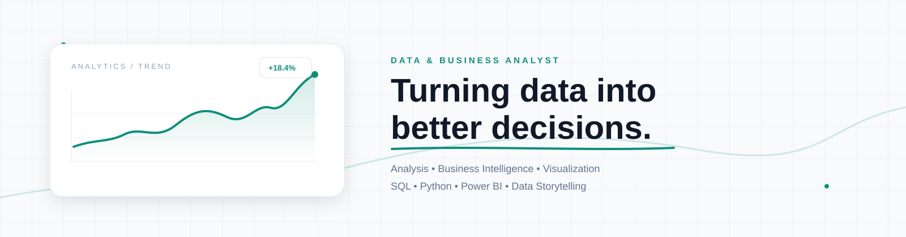

### Data & Business Analyst

**Turning data into clear insights, better decisions, and measurable business value.**

  
  
  
  

---

## About Me

I'm **Mohamed Adel**, a **Data & Business Analyst** focused on transforming raw data into meaningful insights and practical business decisions.

I work across the analytics lifecycle — from **data preparation and SQL analysis** to **Python exploration, BI dashboards, KPI analysis, and data storytelling**.

> **Data is useful when it helps people understand what happened, why it happened, and what to do next.**

---

## What I Do

<table>
<tr>
<td width="25%" align="center">

### 📊
**Data Analysis**

Data Cleaning  
EDA  
Trend Analysis  
Insights

</td>
<td width="25%" align="center">

### 🗄️
**SQL & Data**

Queries  
Joins  
CTEs  
Data Preparation

</td>
<td width="25%" align="center">

### 📈
**Business Intelligence**

Power BI  
DAX  
KPIs  
Dashboards

</td>
<td width="25%" align="center">

### 💡
**Business Analysis**

Performance  
Reporting  
Storytelling  
Decision Support

</td>
</tr>
</table>

---

## Analytics Workflow

**RAW DATA**  
↓  
**CLEAN & TRANSFORM**  
↓  
**EXPLORE & ANALYZE**  
↓  
**MODEL & MEASURE**  
↓  
**VISUALIZE**  
↓  
**BUSINESS INSIGHT**  
↓  
**BETTER DECISION**

---

## Tech Stack

### 🐍 Programming & Data Analysis

### 🗄️ SQL & Databases

### 📈 Business Intelligence & Visualization

### 📊 Visualization & Reporting

### 🔧 Tools & Workflow

---

## 💼 Business Analytics Skills

| Area | Focus |
|:--|:--|
| **Data Analysis** | Cleaning • EDA • Transformation • Trend & Pattern Analysis |
| **SQL Analytics** | Joins • CTEs • Subqueries • Aggregations • Business Queries |
| **Business Intelligence** | Power BI • DAX • Data Modeling • KPI Dashboards |
| **Business Analysis** | Requirements • Performance Analysis • Root Cause Analysis |
| **Reporting** | KPI Reporting • Executive Reporting • Data Storytelling |
| **Decision Support** | Turning analysis into clear, actionable recommendations |

---

## 🌐 Analytics Ecosystem

The broader analytics ecosystem I work with or build toward includes:

**Python** · **SQL** · **Power BI** · **Excel** · **DAX** · **Power Query**  
**Pandas** · **NumPy** · **Matplotlib** · **Seaborn** · **Jupyter**  
**MySQL** · **SQL Server** · **PostgreSQL** · **SQLite**  
**Git** · **GitHub** · **Data Modeling** · **ETL / ELT** · **Data Warehousing**

> Tools such as **Tableau, Looker Studio, R, BigQuery, Snowflake, dbt, and Airflow** are part of the wider analytics ecosystem and are natural next-step technologies as the focus expands.

---

## 📚 Currently Learning

---

## 🤝 Connect With Me

&nbsp;

&nbsp;

  

**DATA • BUSINESS • ANALYTICS • INSIGHTS**

---

Designed with a data-first mindset.

### Data & Business Analyst

**Turning data into clear insights, better decisions, and measurable business value.**

  
  
  
  

---

## About Me

I'm **Mohamed Adel**, a **Data & Business Analyst** focused on transforming raw data into meaningful insights and practical business decisions.

I work across the analytics lifecycle — from **data preparation and SQL analysis** to **Python exploration, BI dashboards, KPI analysis, and data storytelling**.

> **Data is useful when it helps people understand what happened, why it happened, and what to do next.**

---

## What I Do

<table>
<tr>
<td width="25%" align="center">

### 📊
**Data Analysis**

Data Cleaning  
EDA  
Trend Analysis  
Insights

</td>
<td width="25%" align="center">

### 🗄️
**SQL & Data**

Queries  
Joins  
CTEs  
Data Preparation

</td>
<td width="25%" align="center">

### 📈
**Business Intelligence**

Power BI  
DAX  
KPIs  
Dashboards

</td>
<td width="25%" align="center">

### 💡
**Business Analysis**

Performance  
Reporting  
Storytelling  
Decision Support

</td>
</tr>
</table>

---

## Analytics Workflow

**RAW DATA**  
↓  
**CLEAN & TRANSFORM**  
↓  
**EXPLORE & ANALYZE**  
↓  
**MODEL & MEASURE**  
↓  
**VISUALIZE**  
↓  
**BUSINESS INSIGHT**  
↓  
**BETTER DECISION**

---

## Tech Stack

### 🐍 Programming & Data Analysis

### 🗄️ SQL & Databases

### 📈 Business Intelligence & Visualization

### 📊 Visualization & Reporting

### 🔧 Tools & Workflow

---

## 💼 Business Analytics Skills

| Area | Focus |
|:--|:--|
| **Data Analysis** | Cleaning • EDA • Transformation • Trend & Pattern Analysis |
| **SQL Analytics** | Joins • CTEs • Subqueries • Aggregations • Business Queries |
| **Business Intelligence** | Power BI • DAX • Data Modeling • KPI Dashboards |
| **Business Analysis** | Requirements • Performance Analysis • Root Cause Analysis |
| **Reporting** | KPI Reporting • Executive Reporting • Data Storytelling |
| **Decision Support** | Turning analysis into clear, actionable recommendations |

---

## 🌐 Analytics Ecosystem

The broader analytics ecosystem I work with or build toward includes:

**Python** · **SQL** · **Power BI** · **Excel** · **DAX** · **Power Query**  
**Pandas** · **NumPy** · **Matplotlib** · **Seaborn** · **Jupyter**  
**MySQL** · **SQL Server** · **PostgreSQL** · **SQLite**  
**Git** · **GitHub** · **Data Modeling** · **ETL / ELT** · **Data Warehousing**

> Tools such as **Tableau, Looker Studio, R, BigQuery, Snowflake, dbt, and Airflow** are part of the wider analytics ecosystem and are natural next-step technologies as the focus expands.

---

## 📚 Currently Learning

---

## 🤝 Connect With Me

&nbsp;

&nbsp;

  

**DATA • BUSINESS • ANALYTICS • INSIGHTS**

---

Designed with a data-first mindset.

